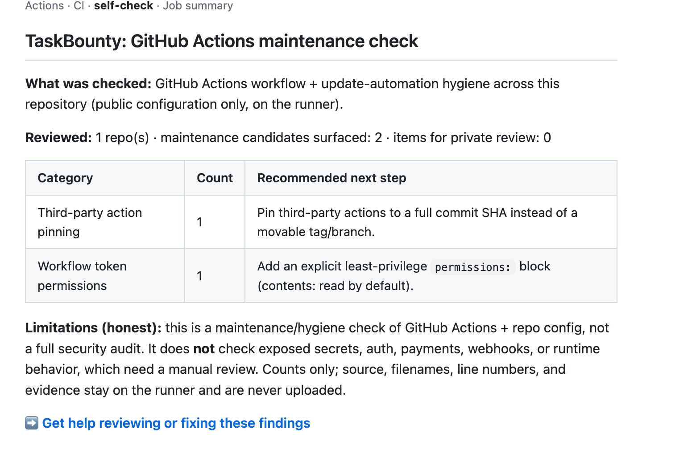

# taskbounty-check

**A local check for GitHub Actions and CI maintenance hygiene** (third-party action pinning,
workflow token permissions, and update automation), built for apps shipped with Lovable, Bolt,
Replit, Cursor, or v0.

**Local by default. No uploads. No telemetry.** It reads only your workflow files, on your machine.
The default code path makes no outbound network requests, writes its report locally, and sends
nothing anywhere. There is no analytics or phone-home of any kind. Only the opt-in `--gh-org` mode
uses the network (through your own `gh` session).

**Works with Cursor, Claude Code, and Codex** (local MCP server, below).

## Three ways to use it

**1. GitHub Action** — add a maintenance check to CI that writes a summary to the run (no PR
comments, no source upload):

```yaml
permissions:
  contents: read
steps:
  - uses: actions/checkout@v4
  - run: npx taskbounty-check@0.1.5 . --github-summary --no-network
```

**2. Agent / MCP** — a local stdio server for Cursor, Claude Code, and Codex:

```bash
npx -y taskbounty-check@0.1.5 mcp
```

**3. One-off CLI** — scan the current repo locally and write a report:

```bash
npx -y taskbounty-check@0.1.5 .
```

> Pin a version (`@0.1.5`) in committed config and CI for reproducibility. `@latest` is convenient
> for a quick one-off, but a pinned version is the reproducible choice.

### A real GitHub job summary

The Action writes a counts-only maintenance summary to the workflow run (categories and next steps,
no filenames, line numbers, or repo source). Example from this repo's own CI:



See it live: the **self-check** job in [this repository's Actions runs](https://github.com/eliottreich/taskbounty-check/actions).

### Learn more

- [Methodology](https://www.task-bounty.com/github-actions-security-check/methodology) — exactly what it reviews and how findings are labeled.
- [Privacy and scope](https://www.task-bounty.com/ai-app-security-check) — local-by-default data handling.
- [Limitations](#supported-checks-and-honest-limitations) — what it does NOT check (below).

## Supported checks (and honest limitations)

**Checks (GitHub Actions + CI maintenance hygiene):**
- Third-party actions pinned to a movable tag/branch instead of a commit SHA
- Broad (write-all) workflow token permissions
- Missing explicit `permissions:` block
- Update automation (Dependabot/Renovate) presence
- Context-dependent workflow patterns flagged for private review (e.g. `pull_request_target`, script injection)

**Does NOT check** (these need a manual review): exposed secrets, auth/authorization, payments,
webhooks, runtime behavior. It is a maintenance/hygiene check, **not** a full security audit or a
penetration test.

## What it does

- Reads only your GitHub Actions workflow files and update-automation config, scans them
  in-process with a deterministic ruleset (the same rules as the public checker), and writes a
  local HTML + JSON report. It does **not** execute workflows, install dependencies, or run any
  repository code.

## Modes

| Mode | Command | Network |
|------|---------|---------|
| Single repo | `npx taskbounty-check .` | none |
| Directory of repos | `npx taskbounty-check ./all-repos` | none |
| Explicit paths | `npx taskbounty-check --manifest repos.json` | none |
| GitHub org (your `gh` session) | `npx taskbounty-check --gh-org <org>` | **yes, opt-in** |

`--gh-org` uses your existing `gh` CLI session to fetch each repo's workflow files **to this
machine** (read-only). Your GitHub token is never read by this tool and never sent to TaskBounty.

## What is read, written, transmitted

Run `--explain-data` to print this at any time.

- **Reads (allowlist — nothing else is opened):** `<repo>/.github/workflows/*.yml|*.yaml` and
  update-automation config (`dependabot.yml`/`renovate.json*`). Never source files, `.env`,
  secrets, SSH keys, credential stores, or anything outside the selected repository roots.
  Symlinks that escape a root are skipped, never followed.
- **Writes (local only):** `<out>.json` (full detail) and `<out>.html`.
- **Transmits:** nothing by default. **`--share` uploads nothing** — it writes a *sanitized,
  counts-only* file (scan id, label, candidate counts by category, private-review **count**,
  scanner version, timestamps; repo names only with `--include-repo-names`) for you to submit
  **manually**. Network stays off under `--share`. Only `--gh-org` intentionally uses the network.

## Flags

`--share` · `--gh-org <org>` · `--manifest <file>` · `--org-label <label>` ·
`--include-repo-names` · `--dry-run` · `--explain-data` · `--delete-local-report` ·
`--no-network` (default everywhere except `--gh-org`) · `--out <basename>` · `--version` · `--help`

## Want help interpreting or fixing these results?

Request a free 20-minute launch-safety review:
https://www.task-bounty.com/ai-app-security-check/review?utm_source=npm&utm_medium=npm_readme&utm_campaign=workflow_security

**TaskBounty receives nothing unless you submit that form.** The scan runs locally and the full
report stays on your machine; the review form gives us no access to your repositories, source,
workflows, or secrets.

## GitHub Code Scanning (SARIF)

Emit SARIF 2.1.0 and surface findings in your repo's Security → Code scanning tab:

```bash
npx taskbounty-check@latest . --format sarif --output taskbounty.sarif
```

The SARIF carries deterministic rule ids (`taskbounty/<rule>`), severity levels, and file/line
references — **no source contents, secrets, or environment values**, and no network access.
Confirmed findings are emitted as `kind: fail`; lower-confidence items as `kind: review`.

Help interpreting SARIF results: https://www.task-bounty.com/ai-app-security-check/review?utm_source=github&utm_medium=sarif_docs&utm_campaign=workflow_security

Upload it with the official action (full example in [`examples/code-scanning.yml`](examples/code-scanning.yml)):

```yaml
permissions:
  contents: read
  security-events: write
steps:
  - uses: actions/checkout@v4
  - run: npx taskbounty-check@0.1.5 . --format sarif --output taskbounty.sarif
  - uses: github/codeql-action/upload-sarif@v3
    with:
      sarif_file: taskbounty.sarif
```

## Local agent (MCP)

Run a **local** stdio MCP server so Codex, Claude Code, or Cursor can scan and reason about findings
in your editor. It runs locally, makes **zero outbound network requests**, uploads no source, and
**never modifies files** — `generate_fix_plan` returns a plan as text for you to apply yourself.

```bash
npx taskbounty-check@latest mcp
```

Tools: `scan_repo` (local scan summary), `explain_finding` (plain-language explanation), `generate_fix_plan` (text fix plan).

Want a human to review the plan? https://www.task-bounty.com/ai-app-security-check/review?utm_source=mcp&utm_medium=mcp_docs&utm_campaign=workflow_security

**Cursor** — `.cursor/mcp.json`:
```json
{ "mcpServers": { "taskbounty-check": { "command": "npx", "args": ["-y", "taskbounty-check@latest", "mcp"] } } }
```

**Claude Code**:
```bash
claude mcp add taskbounty-check -- npx -y taskbounty-check@latest mcp
```

**Codex** — in `~/.codex/config.toml`:
```toml
[mcp_servers.taskbounty-check]
command = "npx"
args = ["-y", "taskbounty-check@latest", "mcp"]
```

## Security

Zero runtime dependencies. Published to npm with provenance (verify on the package's npm page). The
default run makes no outbound requests and uploads nothing; see the
[methodology](https://www.task-bounty.com/github-actions-security-check/methodology) for the full
data-handling and scope boundaries.
